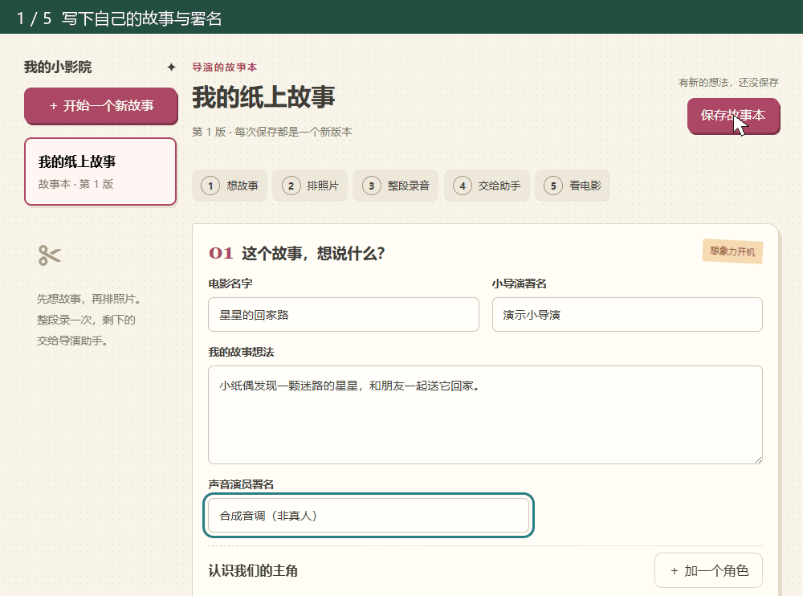
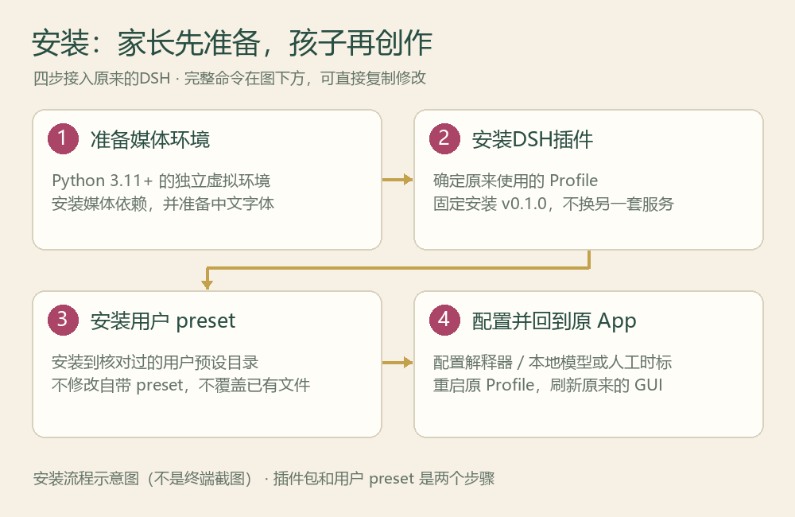
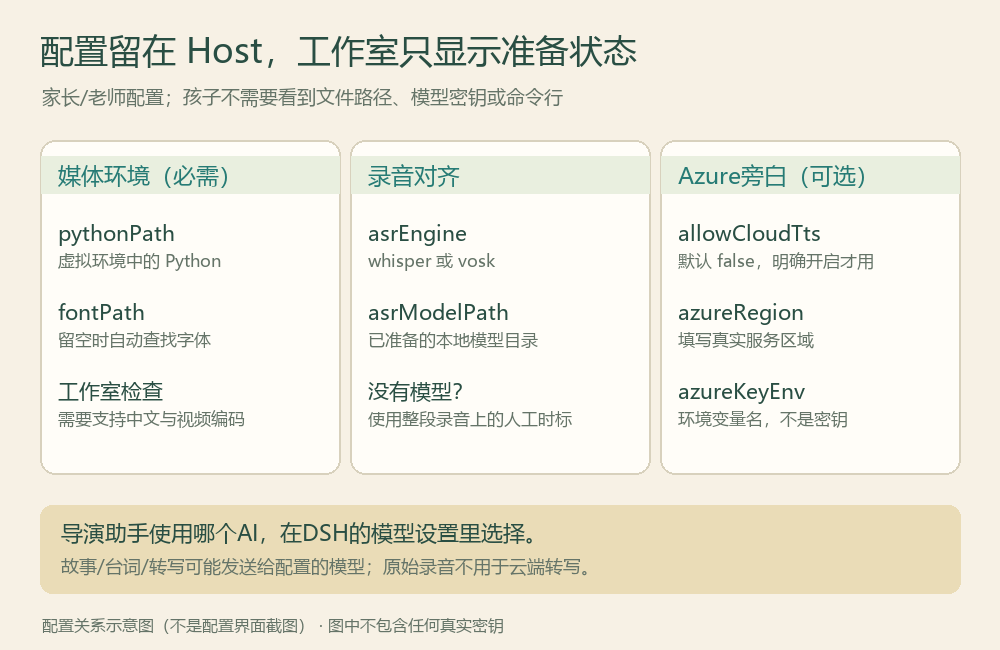
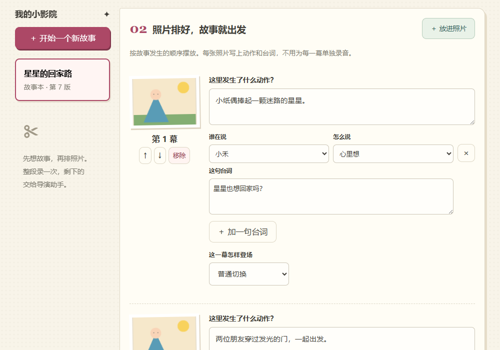
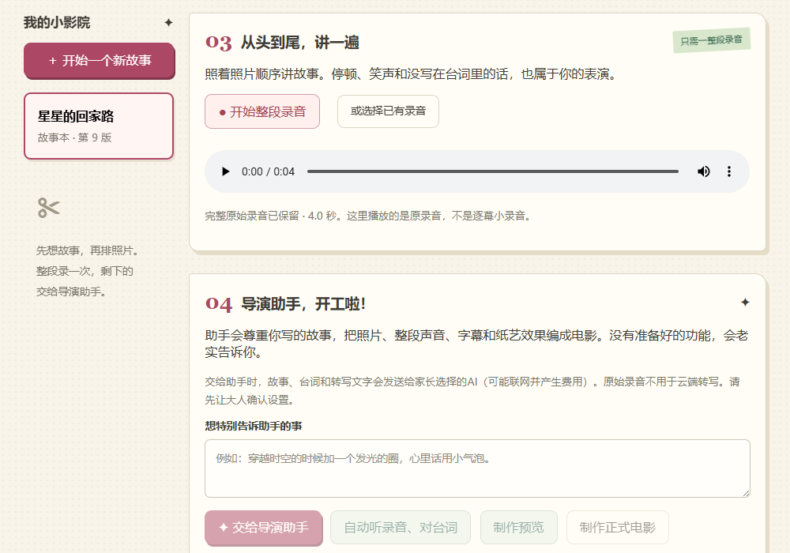
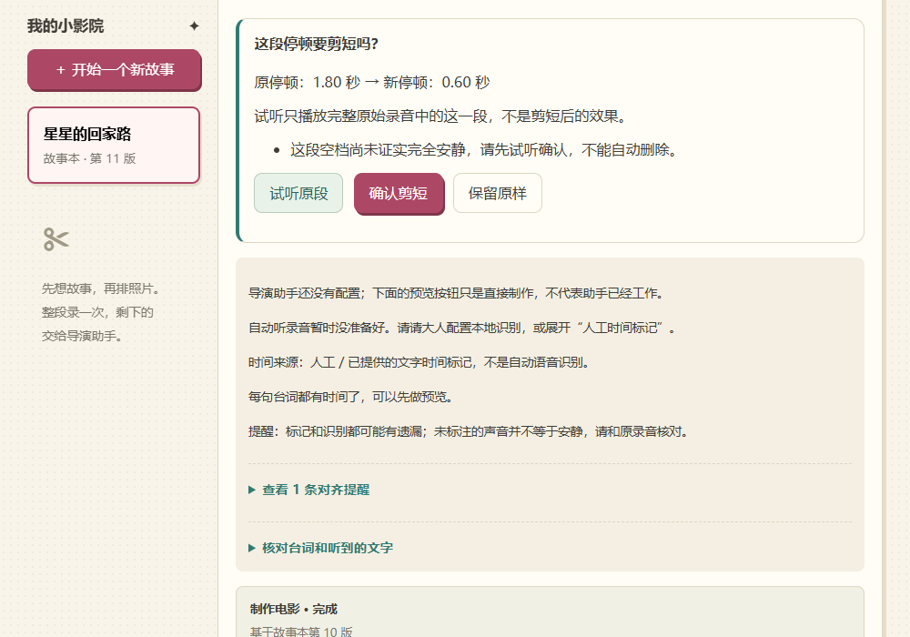
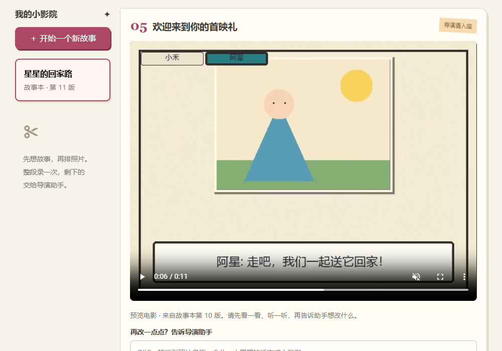

# 图文上手：从安装到第一部纸上电影

纸上小导演把孩子**自己的故事、按顺序排列的图片、每图对白/动作和一整段录音**做成小电影。成人负责安装、模型与隐私设置；孩子在成人陪伴下创作和审片。

> **先知道边界**：这是成人监督的本机工具，不是儿童独立账号，也不是浏览器或操作系统沙箱。受限导演助手不改变共享 DSH 登录本身的权限。完整安装安全说明以 [安装与验证](install.md) 为准，能力边界见 [v0.1 范围](v0.1-scope.md)。

导航：[成人安装](#adult-install) → [成人配置](#adult-configure) → [孩子创作](#child-create) → [看电影与修改](#watch-edit)。



*演示说明：约 8 秒的真实隔离工作室关键帧导览，不是实时完成制作的耗时记录。素材全为匿名几何图片与合成音调，使用人工时间标记、真实 Core 渲染；没有真人麦克风录制、真实 ASR 识别或收费模型调用。它不是“全自动 AI 真人演示”。GIF 本身没有音轨。安装与配置两张图是解释型示意图，不是操作截图或真实配置页面。图文资源在仓库中查看，安装包不附带这些演示媒体。*

<a id="adult-install"></a>
## 一、成人安装：先找到原来的 DSH，再装插件



### 1. 确认目标与准备条件

- 使用已验证的 **DSH 0.1.2-rc.1 / Cordis 4.0.2**；Node.js **22.19+**、Python **3.11+**，目标 DSH 的 `dsh` 命令和 `pnpm` 可用。
- 当前安装版浏览器 seed/生产依赖闭包使用 **React 18.3.1**，SDK 根开发依赖是 **19.2.8**。这不是同时加载两份 React；不需要为看本插件而另装 React 或另建 Web 应用。
- 确认**实际服务原 GUI 的 Profile 名称及其 DSH_HOME**。端口不能推导 Profile 名，不要因为使用本机网页就填 `web`。不确定时先请维护该 DSH 的成人确认，不要试填新名字：CLI 会初始化不存在的 Profile。
- 准备审核过的 v0.1.0 源码或解压包，放在成人拥有的**普通目录**中，供安装 preset 与 Python 依赖使用。无需修改 DSH 部署目录，也不要把家庭媒体放进公开源码仓库。

兼容性与 SDK 依赖限制见 [安装文档：状态与兼容性](install.md#状态与兼容性)。不要因 registry 报错降级 Cordis、改镜像或放开不相关安装脚本。

### 2. 把包安装到已确认的 Profile

将 `<真实profile>` 换成刚确认的名称；尖括号本身不输入。命令会访问 GitHub、写入该 Profile 的依赖；由成人执行，不是本文已经替你安装。

```sh
dsh plugin --profile <真实profile> add github:cloga/dsh-paper-director#v0.1.0 --ignore-scripts
```

语法是 `dsh plugin --profile ...`，不是 `dsh --profile ... plugin`。本包已包含 plain JavaScript/client 工件，不需要启用安装 lifecycle scripts。安装失败就停止检查，不继续假设插件已激活。需要离线 tarball、固定审阅 commit 或隔离验收时，使用 [完整安装步骤](install.md)。

### 3. 单独安装用户 preset

包安装与 preset 安装是两步。先通过活动 DSH 的 preset roster `list()` / `resolve()` 确认用户可写根目录，然后在审核过的源码或解压包根目录执行：

```sh
node scripts/install-preset.mjs --root <verified-user-preset-root> --dry-run
node scripts/install-preset.mjs --root <verified-user-preset-root>
```

- 将占位符换成真实路径；有空格时加引号。`--root` 是容纳多个用户 preset 的根，**不是** `DSH_HOME`，也不是末级 `paper-director`。
- 默认用户根通常为 `${DSH_HOME:-~/.dsh}/.agent-presets`，但自定义 roster 应以实际发现的路径为准。
- 先检查 dry-run 的目标，成功后再复制。目标最终为 `<root>/paper-director/`；已有目标会被拒绝，**不要覆盖、删除重装或寻找 `--force`**。
- 不改部署自带的 shipped preset。安装器拒绝源/目标祖先中的 symlink/junction；若 Profile 的包路径链接到 pnpm store，改用审核过的普通源码/解压目录，不绕过检查。
- 脚本只复制资源，不挂载、不重启。真实挂载验收由成人在授权隔离环境完成，见 [独立用户 preset 安装与安全行为](install.md#3-显式安装独立用户-preset)。

<a id="adult-configure"></a>
## 二、成人配置：本地制作必需，语音识别和云旁白可选



### 1. 准备 Python 和中文字体

从可信源码/解压包根目录创建独立虚拟环境，不安装到 DSH 的 `node_modules`。Windows PowerShell 可以直接调用虚拟环境解释器，无需改变脚本执行策略：

```powershell
python -m venv .venv
.\.venv\Scripts\python.exe -m pip install -r requirements.txt
```

macOS / Linux 对应调用：

```sh
python3 -m venv .venv
./.venv/bin/python -m pip install -r requirements.txt
```

中文标题与字幕需要覆盖相应字符的 CJK 字体。可以使用本机已安装的合适字体，或由成人填写 `fontPath`；缺字不能用乱码“将就通过”。具体字体与内核要求见 [Python 说明](../python/README.md)。

### 2. 给原 Profile 添加完整配置覆盖

编辑**已确认原 Profile** 的用户层文件 `<DSH_HOME>/profiles/<真实profile>/cordis.patch.yml`，不要编辑部署自带 composition，也不要把 Host 行放进 Agent preset。

下面是可复制的条目模板。**先把 `pythonPath` 占位符换成刚安装依赖的 Python 解释器绝对路径**；其他空字符串可以先保留。若文件已有内容，保留其他条目；若已有 `id: paper-director`，审阅并更新该条目，而非重复追加。当前 patch 按 `id` 覆盖的是**整个 `config`**，不是逐字段深度合并，因此不能只写一行 `pythonPath` 而意外丢掉其他配置。

```yaml
- id: paper-director
  config:
    dataDir: !!js dshHomePath('paper-director')
    pythonPath: '<absolute-path-to-venv-python>'
    fontPath: ''
    asrModelPath: ''
    asrEngine: whisper
    allowCloudTts: false
    azureRegion: ''
    azureKeyEnv: AZURE_SPEECH_KEY
```

`pythonPath` 的形式示例为 Windows 的 `'C:\path\to\.venv\Scripts\python.exe'` 或 macOS/Linux 的 `'/path/to/.venv/bin/python'`，都需替换。Windows YAML 路径用单引号。`!!js dshHomePath('paper-director')` 是 DSH 配置表达式，不是普通字符串；它把作品目录放在该 Host 的 DSH home 下。更改已有作品的 `dataDir` 前先备份，不要误以为换目录会自动搬家。

| 配置项 | 谁负责 / 何时需要 |
| --- | --- |
| `dataDir` | Host 保存作品、原素材和版本；使用本机可信位置，不是公开仓库。 |
| `pythonPath` | 必需：指向安装了媒体依赖的解释器，不是虚拟环境目录。 |
| `fontPath` | 可留空走本机字体发现；缺少中文字形时填写适用字体文件。 |
| `asrModelPath` / `asrEngine` | 可选本地 ASR；模型未准备时保留空路径，使用人工时间标记。 |
| `allowCloudTts` / `azureRegion` / `azureKeyEnv` | 可选 Azure 文字旁白；默认关闭，环境变量名不是密钥。 |
| DSH 默认模型 + 用户 preset | 导演助手所需；由成人在 DSH 原有设置中选择 provider/model，安装独立 `paper-director` preset。不是往上述 Host 配置里编造模型字段。 |

### 3. 选择整段录音的对齐方式

**有本地模型**：在同一 Python 虚拟环境中安装 `requirements-asr.txt`，由成人预先准备完整本地 Whisper 或 Vosk 模型目录，再设置 `asrModelPath` 与相应的 `asrEngine`。Whisper 需要兼容 faster-whisper/CTranslate2 的模型，不是任意同名文件。详见 [本地 ASR 要求](../python/README.md#alignment-semantics)。程序不自动下载模型，也不把原录音上传云端转写。按钮可用不等于实际识别质量已验证，仍要听回录音。

**没有模型**：`asrModelPath: ''` 保持不变即可。页面提供人工时间标记；标记的仍是**同一段完整录音**中各句的起止时间，不需要补录成逐幕文件。

### 4. 先确认联网与费用，再启用助手

- 点击“交给导演助手”会把故事、台词、动作说明及转写文字提供给成人选择的 DSH 模型；该模型可能在云端、可能收费。**原录音不做云端 ASR，不代表全部文字都离线。**
- Azure 旁白是另一项可选功能：只有成人明确开启 `allowCloudTts`、设置区域，并在**启动 DSH 的 Host 进程环境**中配置 `azureKeyEnv` 所指环境变量后才使用。仅发送批准朗读的文字，不发送原录音；页面、Agent preset、项目 JSON 和公共仓库都不放密钥。
- 默认关闭 TTS 不妨碍使用自己的完整录音。旁白每天 5000 字符保护不是 DSH 模型费用上限。

### 5. 重启原 Profile，刷新原 GUI

完成成人验收后，按原来的启动方式**重启原 Profile**，再刷新**原 GUI URL**。从 DSH 侧栏的纸上小导演入口进入同源 `/paper-director/`，点击“检查工作室”。

不要另起 `dsh web`、Vite 或其他服务器来“更新”当前 DSH，也不要把隔离测试页面当作生产已安装。顶部状态区分制作工具与助手是否就绪；本地识别、中文字体、Python 依赖缺失时，先由成人解决对应提示。

<a id="child-create"></a>
## 三、孩子创作：先讲自己的故事，再录一次完整表演

### 1. 先构思，再按顺序放图

1. 点击“＋ 开始一个新故事”或“我的第一部电影 →”。
2. 填写“电影名字”“我的故事想法”，用昵称填写小导演和声音演员署名；通过“＋ 加一个角色”定义角色。
3. 点击“＋ 放进照片”，导入自己的静态 JPEG、PNG 或 WebP 图片，用每幕的 **↑ / ↓** 调整故事顺序。不是让 AI 代写一个与自己无关的故事。
4. 每张图填写“这里发生了什么动作？”，用“＋ 加一句台词”添加对白，选择“谁在说”“怎么说”。心里话、小声说和大声喊可以有不同表现；没有对白的动作图不需要硬编一句话。
5. 按需选择普通切换、魔法光圈或时间文字卡，点击“保存故事本”。



*真实隔离 UI 截图；图中的几何角色是生成的匿名演示素材，不是家庭照片。*

### 2. 对照图片，从头到尾录一遍

- 点击“● 开始整段录音”，在成人确认浏览器麦克风权限后，按照片顺序把整个故事演一遍；完成时点击“■ 结束并保留录音”。
- 或用“或选择已有录音”导入一份完整音频。**不要求每幕单独录。**停顿、笑声、临场加的话也是表演的一部分。
- 在“完整原始录音”播放器中听回内容，确认声音与顺序。若提示保存失败，保留当前页面并使用“重试保存刚才的录音”，不要误以为录过就一定保存好了。



*真实隔离 UI 截图；演示上传的是一段合成音调，台词/时标为显式演示输入，不是从音调识别出了人声，也没有真人麦克风录制。*

### 3. 对齐并交给导演助手后期

有模型时可以用“自动听录音、对台词”；没有模型时，展开“自动对齐暂时不能用？请大人帮忙标记时间”：

1. 播放上面的完整录音，在实际说出每句的开始和结束处填写秒数；可用按钮取播放器当前时间。
2. 如果说了脚本外的话，用“＋ 记一段额外的话”补充实际文字与起止时间。
3. 点击“保存人工时间标记”。**没有标记的声音不等于静音**，不要为了让按钮可点而随意填写时间。

在“想特别告诉助手的事”中写制作要求，例如“心里话用小气泡，故事和台词不要改”，再由成人确认点击“✦ 交给导演助手”。助手会使用已配置的能力处理后期；缺模型、缺组件或遇到不确定内容时需要确认，并非一键保证成功。

“制作预览”和“制作正式电影”也可直接使用当前已具备条件的故事本与对齐结果渲染，**直接渲染不代表 Agent 已经工作**。看页面任务状态和实际电影结果，不把“助手这一轮回复结束”当作制作完成。

<a id="watch-edit"></a>
## 四、看电影与修改：先听确认，再保留新版本

### 1. 先处理待确认的剪辑

助手提出缩短停顿时，页面显示“这段停顿要剪短吗？”：

- 点击“试听原段”，听的是**完整原录音中的该段**，不是剪短后的效果。
- 确定没有想保留的表演，再点“确认剪短”；不想改就点“保留原样”。
- 听不清、笑声或没写在台词里的话不能直接当成无用空白。应用后再看新预览，检查节奏是否合适。



*真实隔离 UI 截图；审阅提案用于展示人工确认流程，不是收费模型推理或真人语音判断的证据。*

### 2. 看预览、说修改、制作正式电影



*真实隔离 UI 与 Core 渲染的 MP4；匿名几何图、合成音调、人工时标。画面能播放不等于已完成人工听感审核或真实 ASR 质量验证。*

1. 在“欢迎来到你的首映礼”播放预览，和孩子一起看对白、字幕、图片顺序、停顿与音量。
2. 在“再改一点点？告诉导演助手”中描述具体改动，例如“第二张照片多停一会儿”“这句是另一个角色说的”，点击“把我的修改告诉助手 →”。成人启用的 DSH 模型会处理文字反馈，也可能产生费用。
3. 如需按时间定位，明确说的是**当前正在看的电影**中的位置；电影秒数可能含片头/过场，不能直接当作原录音秒数。
4. 等新预览完成并再次确认后，点击“制作正式电影”；完成的 H.264/AAC MP4 会出现在同一播放器。当前页面没有单独的“下载电影”按钮；若要保存副本，可使用浏览器提供的视频保存功能（是否提供取决于浏览器）。
5. 不满意时展开“翻翻以前的版本”→“查看版本”→“恢复为新版本”。先保存想保留的输入；恢复不会覆盖原照片、原录音或已保存历史，但会放下当前未保存的想法。

## 常见卡点

| 看到什么 | 先检查什么 |
| --- | --- |
| 原 GUI 没有入口 | 是否装到了真实 Profile、包安装是否成功、是否已重启原 Profile 并刷新原 GUI；不要再启动一个服务器。 |
| “工作室还需要大人帮忙准备” | `pythonPath` 是否指向安装了依赖的解释器、中文字体/编码器是否就绪；点“检查工作室”。 |
| “助手待配置”或助手按钮不能用 | 独立用户 preset 是否被原 DSH roster 发现、DSH 默认 provider/model 是否已选择；状态就绪也不是实际模型推理验收。 |
| “自动听录音”不能用 | 本地 ASR 模型与依赖是否齐全；也可对同一段录音做人工时间标记，无需逐幕重录。 |
| 预览/正式电影按钮不能用 | 是否已有图片、完整录音和需要的台词时间，是否仍有任务进行中，制作工具是否就绪。 |
| 助手停止了，但没有新电影 | 查看任务状态、可见回复和待确认卡；回复结束不等于渲染成功，冷会话也不会擅自重新创建。 |
| 改动与新任务结果冲突 | 保留输入，按页面提示处理版本冲突；不要反复点击提交或认为旧任务能覆盖新版。 |

进一步阅读：[完整安装与安全说明](install.md) · [版本范围与费用边界](v0.1-scope.md) · [验证证据](verification.md) · [返回 README](../README.md)。
